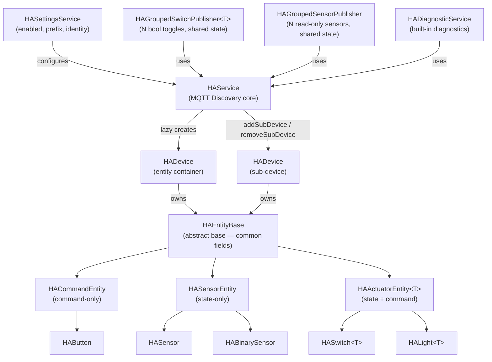

# Home Assistant Integration

The framework provides native **Home Assistant MQTT Discovery** integration. Devices and entities register themselves automatically in Home Assistant the moment MQTT becomes available — and are automatically removed when HA integration is disabled — no manual HA configuration required.

## Architecture Overview



### What the framework handles automatically

| Responsibility | Handled by |
|---|---|
| MQTT Discovery config publish on every (re)connect | `HAService::publishAll()` via a dedicated FreeRTOS task |
| MQTT Discovery config removal when HA is disabled | `HAService::unpublishAll()` — empty retained payloads sent to all discovery topics before `setEnabled(false)` |
| MQTT broker credentials & connection lifecycle | `MqttSettingsService` |
| Device identity JSON (name, manufacturer, model, MAC …) | `HADevice` / `HADeviceIdentity` |
| HA settings UI (enabled toggle, prefix, identity fields) | `HASettingsService` |
| Built-in status / heap / temperature / restart entities | `HADiagnosticService` |
| OTA update progress entity | `HAUpdateService` |

**Origin ID:** All HA-originated `StatefulService` updates carry the origin id `"ha"` (constant `HA_ORIGIN_ID`). Downstream update handlers can use this to distinguish HA commands from local, HTTP, or Event Socket updates.

---

## Enabling the Integration

HA integration is enabled at runtime via the web UI under **Connections → MQTT → Home Assistant**. Default values can be set at compile time in `factory_settings.ini`:

```ini
-D FACTORY_HA_ENABLED=false
-D FACTORY_HA_DISCOVERY_PREFIX=\"homeassistant/\"
-D FACTORY_HA_DEVICE_NAME=\"\"        ; empty → falls back to APP_NAME
-D FACTORY_HA_MANUFACTURER=\"\"
-D FACTORY_HA_MODEL=\"\"
```

`HAService` is always instantiated by the framework. When HA is disabled at runtime, `HASettingsService` calls `unpublishAll()` while MQTT is still connected, sending empty retained payloads to every discovery topic so HA removes the device immediately. After that, all discovery and state publishes become silent no-ops — all entity objects are safe to construct unconditionally regardless of the enabled state.

---

## Core Classes

### HAService

`lib/framework/HomeAssistant/HAService.h`

The central service accessed via `ESP32SvelteKit`:

```cpp
HAService *ha = esp32sveltekit.getHAService();
```

Key responsibilities:

- Builds and publishes MQTT Discovery config topics
- Publishes state payloads and manages subscriptions
- Fires `publishAll()` on every MQTT (re)connect via a dedicated FreeRTOS task (keeps MQTT event thread free for synchronous publishes)
- Calls `unpublishAll()` when HA is disabled — invokes all `onUnpublishAll` callbacks (grouped publishers) then unpublishes `HADevice`-owned entities, so HA removes the device completely
- Exposes `onPublishAll()` / `onUnpublishAll()` for grouped publishers to hook into the full publish/unpublish lifecycle
- Exposes `mainDevice()` — the lazy-created `HADevice` for the firmware

### HADevice

`lib/framework/HomeAssistant/HADevice.h`

Owns a collection of entities and publishes them together. Access via `haService->mainDevice()`. Entities are registered by category, which controls where they appear in the HA device page:

| Method | HA category | HA page section |
|---|---|---|
| `registerControl(entity)` | — | Controls |
| `registerConfig(entity)` | `config` | Configuration |
| `registerDiagnostic(entity)` | `diagnostic` | Diagnostic |

```cpp
haService->mainDevice().registerControl(std::move(light));
haService->mainDevice().registerConfig(std::move(sw));
haService->mainDevice().registerDiagnostic(std::move(btn));
```

Entities are passed as `std::unique_ptr<HAEntityBase>` — `HADevice` takes ownership.

### HAEntityBase

`lib/framework/HomeAssistant/HAEntityBase.h`

Abstract base for all single entities. Provides typed, chainable setters for the common HA discovery fields shared by every entity type:

| Setter | Discovery field |
|---|---|
| `setName(name)` | `name` |
| `setIcon(icon)` | `icon` |
| `setDeviceClass(cls)` | `device_class` |
| `setEntityCategory(cat)` | `entity_category` — accepts `HACategory::Control` (no key), `HACategory::Config`, `HACategory::Diagnostic`; set automatically by `registerControl/Config/Diagnostic` |
| `setObjectIdHint(hint)` | `object_id` |
| `setEnabledByDefault(bool)` | `enabled_by_default` |
| `setAvailabilityTopic(t)` | `availability_topic` |
| `setExtraConfig(lambda)` | escape hatch — runs after all typed setters |

All setters are chainable and return `HAEntityBase &`.

---

## MQTT Infrastructure Base Classes

Three base classes capture the distinct MQTT topology patterns. Entity-type-specific HA discovery fields (payload format, schema, units, …) are passed as a **ConfigBuilder lambda** to each constructor — keeping the base classes free of HA payload format knowledge.

### HACommandEntity

`lib/framework/HomeAssistant/HACommandEntity.h`

**Command-only** — subscribes to a `command_topic`, invokes an `Action` callback. No state topic. Suitable for `button`, `scene`, `trigger`.

```cpp
HACommandEntity(HAService     *haService,
                const String  &component,
                const String  &objectId,
                Action         onPress,         // std::function<void()>
                ConfigBuilder  configBuilder = {});
```

### HASensorEntity

`lib/framework/HomeAssistant/HASensorEntity.h`

**State-only** — publishes to a `state_topic`. No command subscription. Suitable for `sensor`, `binary_sensor`, `event`.

```cpp
HASensorEntity(HAService     *haService,
               const String  &component,
               const String  &objectId,
               ValueReader    reader,    // std::function<String()>
               ConfigBuilder  configBuilder = {});

void publishState();   // re-publish current value without re-sending config
```

### HAActuatorEntity\<T\>

`lib/framework/HomeAssistant/HAActuatorEntity.h`

**State + Command** — bound to a `StatefulService<T>`. Publishes state on connect and on every service change; subscribes to `command_topic` and applies incoming commands back to the service.

```cpp
HAActuatorEntity(StateSerializer  serializer,   // std::function<String(const T &)>
                 CommandApplier   applier,       // std::function<StateUpdateResult(const String &, T &)>
                 StatefulService<T> *service,
                 HAService        *haService,
                 const String     &component,
                 const String     &objectId,
                 ConfigBuilder     configBuilder = {});
```

---

## Entity Wrappers

Thin wrappers that set `component` and provide convenience constructors. All are header-only.

### HAButton

`lib/framework/HomeAssistant/HAButton.h` — wraps `HACommandEntity`, component = `"button"`.

```cpp
auto btn = new HAButton(haService, "restart",
    []() {
        vTaskDelay(pdMS_TO_TICKS(1000));
        RestartService::restartNow();
    },
    [](JsonObject &c) { c["payload_press"] = "PRESS"; });

btn->setName("Restart").setIcon("mdi:restart");
haService->mainDevice().registerDiagnostic(std::unique_ptr<HAButton>(btn));
```

### HASensor

`lib/framework/HomeAssistant/HASensor.h` — wraps `HASensorEntity`, component = `"sensor"`.

```cpp
auto temp = new HASensor(haService, "core_temp",
    []() { return String(temperatureRead()); },
    [](JsonObject &c) {
        c["unit_of_measurement"] = "°C";
        c["device_class"]        = "temperature";
        c["state_class"]         = "measurement";
    });
temp->setName("Core Temperature");
haService->mainDevice().registerDiagnostic(std::unique_ptr<HASensor>(temp));
```

### HABinarySensor

`lib/framework/HomeAssistant/HABinarySensor.h` — wraps `HASensorEntity`, component = `"binary_sensor"`. Accepts a `bool`-returning reader and converts it to `"ON"`/`"OFF"`.

```cpp
auto motion = new HABinarySensor(haService, "motion",
    []() { return motionDetected(); },
    [](JsonObject &c) { c["device_class"] = "motion"; });
motion->setName("Motion");
haService->mainDevice().registerControl(std::unique_ptr<HABinarySensor>(motion));
```

### HASwitch\<T\>

`lib/framework/HomeAssistant/HASwitch.h` — wraps `HAActuatorEntity<T>`, component = `"switch"`. Accepts a getter/setter pair for one `bool` field. Publishes `"ON"`/`"OFF"`.

```cpp
auto sw = new HASwitch<MySettings>(
    [](const MySettings &s) { return s.enabled; },
    [](MySettings &s, bool v) { s.enabled = v; },
    myService, haService, "enabled");
sw->setName("Enabled").setIcon("mdi:power");
haService->mainDevice().registerConfig(std::unique_ptr<HASwitch<MySettings>>(sw));
```

### HALight\<T\>

`lib/framework/HomeAssistant/HALight.h` — wraps `HAActuatorEntity<T>`, component = `"light"`. Uses `JsonStateReader<T>` / `JsonStateUpdater<T>` — the same pattern as `HttpEndpoint<T>`. State and commands are JSON objects.

```cpp
auto light = new HALight<LightState>(
    LightState::haRead, LightState::haUpdate, this, haService, "led",
    [](JsonObject &c) {
        c["schema"]     = "json";
        c["brightness"] = false;
    });
light->setName("LED").setIcon("mdi:led-on");
haService->mainDevice().registerControl(std::unique_ptr<HALight<LightState>>(light));
```

---

## Grouped Publishers

For N entities of the same type sharing **one MQTT state topic**. Each entity still has its own discovery config; only the state publish is shared — reducing MQTT traffic and ensuring atomic state delivery.

### HAGroupedSwitchPublisher\<T\>

`lib/framework/HomeAssistant/HAGroupedSwitchPublisher.h`

N boolean fields of one `StatefulService<T>`, each mapped to its own HA switch entity. State is re-published on every service change.

**Topic structure:**

| Topic | Purpose |
|---|---|
| `~/<topicSuffix>/state` | Shared JSON: `{"field_a":"ON","field_b":"OFF"}` |
| `~/<topicSuffix>/<objectId>/set` | Per-switch command topic |

```cpp
class LightSettings {
    // ...
    static bool getSoftDimming(const LightSettings &s) { return s.softDimming; }
    static void setSoftDimming(LightSettings &s, bool v) { s.softDimming = v; }
    static bool getActiveLow(const LightSettings &s) { return s.activeLow; }
    static void setActiveLow(LightSettings &s, bool v) { s.activeLow = v; }
};

class LightSettingsService : public StatefulService<LightSettings> {
public:
    LightSettingsService(PsychicHttpServer *server, ESP32SvelteKit *sk)
        : /* ... endpoints ... */
          _haSwitches(this, sk->getHAService(), "light_settings")
    {
        _haSwitches
            .addSwitch("soft_dimming", "Soft Dimming",
                       LightSettings::getSoftDimming, LightSettings::setSoftDimming,
                       "mdi:brightness-6", HACategory::Config)
            .addSwitch("active_low", "Active Low",
                       LightSettings::getActiveLow, LightSettings::setActiveLow,
                       "mdi:toggle-switch-off-outline", HACategory::Config);
    }

    void begin() { /* ... */ _haSwitches.begin(); }

private:
    HAGroupedSwitchPublisher<LightSettings> _haSwitches;
};
```

`addSwitch` signature:

```cpp
addSwitch(objectId, name, getter, setter,
          icon = "", category = HACategory::Control, extraConfig = {})
```

`name`, `icon`, and `category` are typed parameters — no ConfigBuilder boilerplate for these universal fields. The optional `extraConfig` lambda is an escape hatch for any remaining entity-specific fields.

**`unpublishAll()`** sends empty retained payloads to the shared state topic and each switch's config topic. Called automatically via `HAService::onUnpublishAll` when HA integration is disabled — no manual call required.

### HAGroupedSensorPublisher

`lib/framework/HomeAssistant/HAGroupedSensorPublisher.h`

N read-only sensor (or binary_sensor) entities sharing one state topic. Pull-based: a `StateReader` lambda writes all values into the shared JSON object whenever `publishState()` is called — typically from a periodic FreeRTOS timer or on demand after a readout.

Constructor signature:

```cpp
HAGroupedSensorPublisher(HAService     *haService,
                         const String  &topicSuffix,
                         StateReader    stateReader,
                         HADevice      *ownerDevice = nullptr);
```

Pass `ownerDevice = nullptr` (the default) to publish against the main device. Pass a sub-device pointer to scope all topics under that sub-device and attach its identity block to every discovery config — see [Sub-device grouping](#sub-device-grouping) below.

**Main-device example:**

```cpp
HAGroupedSensorPublisher _diag(sk->getHAService(), "diagnostics",
    [](JsonObject &state) {
        state["heap_pct"] = 100.0f * ESP.getFreeHeap() / ESP.getHeapSize();
        state["temp"]     = temperatureRead();
    });

_diag
    .addSensor("sensor", "free_heap", "Free Heap", "mdi:memory", HACategory::Diagnostic,
        [](JsonObject &c) {
            c["value_template"]      = "{{value_json.heap_pct|round(1)}}";
            c["unit_of_measurement"] = "%";
            c["state_class"]         = "measurement";
        })
    .addSensor("sensor", "core_temp", "Core Temperature", "mdi:thermometer", HACategory::Diagnostic,
        [](JsonObject &c) {
            c["value_template"]      = "{{value_json.temp|round(1)}}";
            c["unit_of_measurement"] = "°C";
            c["device_class"]        = "temperature";
            c["state_class"]         = "measurement";
        });

_diag.begin();

// From a FreeRTOS timer:
_diag.publishState();
```

`addSensor` signature:

```cpp
addSensor(component, objectId, name,
          icon = "", category = HACategory::Control, extraConfig = {})
```

Entity-specific fields (`value_template`, `unit_of_measurement`, `device_class`, `state_class`) go in the `extraConfig` lambda; `name`, `icon`, and `category` are typed parameters.

**`unpublishAll()`** sends empty retained payloads to every entity's discovery config topic and to the shared state topic — mirroring `HADevice::unpublishAll()`. This is called automatically via `HAService::onUnpublishAll` when HA integration is disabled. It can also be called manually before destroying the publisher (e.g., when the owning sub-device is removed).

#### Sub-device grouping

When a gateway sub-device exposes many read-only diagnostics (e.g., radio readings, sensor stats), registering one `HAGroupedSensorPublisher` per sub-device collapses N separate state-topic publishes into one JSON publish per readout. Pass the sub-device's raw `HADevice *` as `ownerDevice`:

```cpp
HADevice *raw = _haService->addSubDevice(std::move(dev));

auto diag = std::make_unique<HAGroupedSensorPublisher>(
    _haService, "diagnostics",
    [this, nodeId](JsonObject &state) {
        const NodeData *d = _findNode(nodeId);
        if (!d) { state["available"] = false; return; }
        state["available"]   = true;
        state["battery_low"] = d->batteryLow;
        state["temp"]        = d->temperature;
        // … additional fields
    },
    raw);   // <-- ownerDevice

diag->addSensor("binary_sensor", "battery_low", "Battery",
    "mdi:battery-alert", HACategory::Diagnostic,
    [](JsonObject &c) {
        c["value_template"]    = "{{ value_json.battery_low }}";
        c["device_class"]      = "battery";
        c["availability_topic"]   = "~/diagnostics/state";
        c["availability_template"] = "{{ 'online' if value_json.available else 'offline' }}";
    });
// … more addSensor() calls

diag->begin();
// On each readout:
diag->publishState();
```

Topics produced (with `ownerDevice` set to the sub-device):

| Topic | Purpose |
|---|---|
| `~/diagnostics/state` (`~` = sub-device base topic) | Shared JSON for all N entities |
| `{discoveryPrefix}{component}/{subDeviceId}/{objectId}/config` | Per-entity discovery config |

The `unique_id` of each entity is `{subDeviceId}_{objectId}`, matching the scheme used by directly-registered `HASensor`/`HABinarySensor` entities — so switching from individual entities to a grouped publisher preserves entity continuity in HA (no history loss, no user customisations lost).

**Folded availability** — folding the availability flag into the shared state JSON (`state["available"] = bool`) and using `availability_template` in each entity's config avoids a separate availability topic entirely. All N entities flip between available/unavailable atomically when the state message is received.

---

## Sub-Devices (Gateway Pattern)

Some firmware acts as a **gateway** — it bridges several physical devices (remote nodes, alarm lines, RF detectors, …) to Home Assistant. Each bridged node should appear in HA as its own device, grouped together on its own device page, rather than having all entities lumped onto the gateway's main device.

The framework supports this via `HAService::addSubDevice()` and `HAService::removeSubDevice()`. Each sub-device has its own `HADeviceIdentity` and its own `HADevice`, and its MQTT topics are nested under the main device's base topic:

```
{discoveryPrefix}{namespace}/{mainDeviceId}/{subDeviceId}/{entityId}/state
```

### HADeviceIdentity fields for sub-devices

| Field | Description |
|---|---|
| `id` | Unique device identifier — must be stable per node (need not be globally unique; the topic namespace makes it unique per gateway) |
| `name` | Human-readable name shown in HA |
| `manufacturer` / `model` | Optional — for the physical remote node |
| `serialNumber` | Optional — physical hardware serial number, shown in HA device info panel |
| `suggestedArea` | Optional — HA room/area hint (e.g., `"Living Room"`) |
| `viaDevice` | Set automatically by `addSubDevice()` to the main device's ID (for HA device graph) |
| `topicNamespace` | Set automatically by `addSubDevice()` to `{mainNamespace}/{mainDeviceId}` — scopes all MQTT topics under the gateway instance |

### Adding a sub-device

Build the device, register its entities, then hand ownership to `addSubDevice()`. If MQTT is already connected, discovery configs are published immediately; otherwise on the next connect.

```cpp
#include <HomeAssistant/HADevice.h>
#include <HomeAssistant/HAButton.h>
#include <HomeAssistant/HABinarySensor.h>

void GatewayService::onNodeDiscovered(const String &nodeId, const String &area)
{
    HADeviceIdentity id;
    id.id            = _haService->getDeviceId() + "-" + nodeId;
    id.name          = "Node " + nodeId;
    id.suggestedArea = area;    // e.g., "Living Room"
    // viaDevice and topicNamespace filled in automatically by addSubDevice()

    auto dev = std::make_unique<HADevice>(_haService, std::move(id));

    // Register entities on the sub-device
    auto alarm = std::make_unique<HABinarySensor>(_haService, "alarm",
        []() { return alarmActive(); },
        [](JsonObject &c) { c["device_class"] = "motion"; });
    alarm->setName("Alarm");
    dev->registerControl(std::move(alarm));

    auto reset = std::make_unique<HAButton>(_haService, "reset",
        [nodeId]() { sendResetCommand(nodeId); });
    reset->setName("Reset").setIcon("mdi:restart");
    dev->registerDiagnostic(std::move(reset));

    // Hand ownership to HAService — returns a raw pointer valid until removed
    HADevice *raw = _haService->addSubDevice(std::move(dev));
    _nodeDevices[nodeId] = raw;   // store for later removal
}
```

### Removing a sub-device

`removeSubDevice()` sends empty retained payloads to all entity discovery topics — HA removes the device from its registry. Then the `HADevice` is destroyed.

```cpp
void GatewayService::onNodeLost(const String &nodeId)
{
    String deviceId = _haService->getDeviceId() + "-" + nodeId;
    _haService->removeSubDevice(deviceId);
    _nodeDevices.erase(nodeId);
}
```

> **Destructor note:** The `HADevice` destructor does **not** call `unpublishAll()` automatically. On firmware restart HA should keep the retained config so the device remains visible. Only call `removeSubDevice()` (or `unpublishAll()` directly) when the device should be explicitly removed from HA — e.g., when a node is decommissioned.

### MQTT topic layout (example)

State / command topics (unchanged):
```
homeassistant/my-gateway/my-gateway-aabbcc/node-01/alarm/state
homeassistant/my-gateway/my-gateway-aabbcc/node-01/reset/set
```

Discovery config topics (scoped under the gateway):
```
homeassistant/binary_sensor/my-gateway/my-gateway-aabbcc/node-01/alarm/config
homeassistant/button/my-gateway/my-gateway-aabbcc/node-01/reset/config
```

The `{topicNamespace}/{id}` segment in the config topic path — `my-gateway/my-gateway-aabbcc/node-01` — mirrors the structure of the state/command topic path. This scoping guarantees that entity config topics are globally unique per gateway instance: if a second gateway with a different MAC publishes the same logical node ID (`node-01`), its discovery configs land on completely separate MQTT topics and HA registers them as separate devices rather than merging them.

> **Breaking change when upgrading:** Config topic paths changed from `{prefix}{component}/{id}/{objectId}/config` to `{prefix}{component}/{topicNamespace}/{id}/{objectId}/config`. Retained discovery messages at the old topic paths will remain in the MQTT broker until they expire or are cleared manually. After first boot with the new firmware, delete the stale retained messages on the old paths (or use an MQTT client to send an empty retained payload to each) and remove the orphaned devices from HA.

---

## Built-in Framework Services

All three services are instantiated and started automatically by `ESP32SvelteKit::begin()` — no application code required.

### HADiagnosticService

`lib/framework/HomeAssistant/HADiagnosticService.h`

Provides four diagnostic entities that work on every ESP32 board without any application code:

| Entity | HA Component | HA Category | Value / behaviour |
|---|---|---|---|
| Status | `sensor` | Diagnostic | Always `"online"` while MQTT is connected; HA marks it unavailable on disconnect via the LWT mechanism |
| Free Heap | `sensor` | Diagnostic | Heap utilisation in percent — `free_heap / total_heap × 100` |
| Core Temperature | `sensor` | Diagnostic | ESP32 die temperature in °C via `temperatureRead()` |
| Restart | `button` | Control | Publishes `PRESS` payload; device restarts after 1 s |

**Implementation details:**

- The three sensors (Status, Free Heap, Core Temperature) share a single MQTT state topic `~/<deviceId>/diagnostics/state` via `HAGroupedSensorPublisher`. Their individual discovery configs each carry a `value_template` that extracts the right key from the shared JSON payload.
- State is a JSON object: `{"state":"online","free_heap_percent":42.3,"core_temp":41.7}`.
- Sensor values are refreshed every **60 seconds** via an auto-reload FreeRTOS timer (`xTimerCreate`). On MQTT reconnect the values are also republished immediately as part of `publishAll()`.
- The Restart button is registered on `haService->mainDevice()` via `registerControl()` — it appears under **Controls** on the HA device page, not in the Diagnostic section.

### HAUpdateService

`lib/framework/HomeAssistant/HAUpdateService.h`

Provides a native HA `update` entity that integrates with Home Assistant's **Update** integration — the same card shown for core and HACS updates.

**What it does:**

| Capability | Details |
|---|---|
| Discovery | Publishes an `update` component config with `device_class = "firmware"` |
| Version display | Shows installed version (`APP_VERSION`) and latest GitHub release version side by side in HA |
| Update available badge | HA automatically highlights the device card when a newer version is found |
| Install from HA | User clicks **Install** in HA; the device fetches the firmware binary over HTTPS and flashes via OTA |
| Progress reporting | OTA percentage is published to the MQTT state topic (`in_progress`, `update_percentage`) in real time, giving HA a live progress bar |
| WebSocket mirroring | OTA progress is simultaneously sent to the Web UI over the existing EventSocket so both UI surfaces stay in sync |
| Periodic GitHub polling | Polls GitHub Releases API every **6 hours** (30-minute timer × 12 callbacks) using `GITHUB_REPO_OWNER`/`GITHUB_REPO_NAME` build flags |
| Boot-time check | First check is triggered immediately after WiFi connects on first boot |
| Error recovery | If OTA fails, the update entity reverts to idle state; a concurrent-install guard prevents double-flash |

The install command topic is `~/<deviceId>/update/install`; state is published on `~/<deviceId>/update/state` as a JSON object matching the HA [MQTT Update](https://www.home-assistant.io/integrations/update.mqtt/) payload schema:

```json
{
  "installed_version": "0.7.0",
  "latest_version": "0.8.0",
  "title": "My Firmware v0.8.0",
  "release_url": "https://github.com/owner/repo/releases/latest",
  "in_progress": false
}
```

**Dependencies:** `FT_DOWNLOAD_FIRMWARE=1` must be enabled (required for the OTA engine). `GITHUB_REPO_OWNER` and `GITHUB_REPO_NAME` must be defined in `platformio.ini` build flags.

---

## Memory Footprint

The entire HA integration is wrapped in `#if FT_ENABLED(FT_HOME_ASSISTANT)`. When the feature is disabled the linker removes all HA code — zero flash and zero RAM overhead.

### When disabled (`FT_HOME_ASSISTANT=0`)

| Resource | Overhead |
|---|---|
| Flash (code + rodata) | 0 bytes — all HA translation units excluded from build |
| RAM (heap + stacks) | 0 bytes — no objects instantiated, no tasks created |

### When enabled (`FT_HOME_ASSISTANT=1`)

**Persistent RAM** (held for the lifetime of the firmware):

| Source | Size |
|---|---|
| `ha_publish` FreeRTOS task stack (HAService) | 6 144 bytes |
| `ha_update_chk` FreeRTOS task stack (HAUpdateService) | 8 192 bytes |
| Two FreeRTOS software timers (diagnostic + update-check) | ~200 bytes |
| Service objects (HAService, HASettingsService, HADiagnosticService, HAUpdateService) | ~500 bytes |
| **Total persistent RAM** | **~15 KB** |

**Transient RAM** (allocated during discovery publish, released immediately after):

- One `JsonDocument` per entity config payload — typically 256–512 bytes each, allocated on the heap and freed before the next entity is processed.
- During a full `publishAll()` the peak transient allocation is roughly 1–2 KB.

**Flash:**

The code footprint depends on which entity types are used and which compiler optimisations apply. A rough comparison of a minimal demo build:

| Configuration | Approximate flash delta |
|---|---|
| `FT_HOME_ASSISTANT=0` (baseline) | — |
| `FT_HOME_ASSISTANT=1` + built-in services only | +~25–35 KB |
| + application entities (HALight, HAGroupedSwitchPublisher, …) | +~2–5 KB per added entity class |

> Measure precisely with `pio run -e <env> -t size` and compare builds with and without `FT_HOME_ASSISTANT`.

---

## Choosing the Right Class

| Use case | Class |
|---|---|
| Action with no state (restart, factory reset …) | `HAButton` |
| Read-only numeric/string value | `HASensor` |
| Read-only boolean value | `HABinarySensor` |
| One boolean toggle bound to a `StatefulService<T>` | `HASwitch<T>` |
| JSON-state entity (light, cover, fan …) | `HALight<T>` |
| Several boolean toggles on one `StatefulService<T>` | `HAGroupedSwitchPublisher<T>` |
| Several read-only metrics refreshed on a timer | `HAGroupedSensorPublisher` |
| Several read-only diagnostics on a sub-device, shared state topic | `HAGroupedSensorPublisher` with `ownerDevice` |
| Custom HA entity type not covered above | `HACommandEntity`, `HASensorEntity`, or `HAActuatorEntity<T>` directly |
| N remote nodes — each its own HA device | `HAService::addSubDevice()` / `removeSubDevice()` |

---

## FAQ

**Why does my entity revert to its previous state in HA after a command?**

HA non-optimistic mode requires the device to echo the new state back on the state topic after every command. All entity classes do this automatically. If you build a custom entity on top of `HAActuatorEntity<T>`, ensure your `StateSerializer` is called after every `StatefulService<T>` update.

**Can I register entities without HA being enabled in settings?**

Yes. All classes check `HAService::isReady()` before publishing. When HA is disabled the calls are silent no-ops, so entities can be constructed and registered unconditionally.

**How do I add entity-specific discovery fields not covered by a typed setter?**

For individual entities (`HASwitch`, `HASensor`, …) pass them in the `extraConfig` / `configBuilder` lambda:

```cpp
auto sw = new HASwitch<MySettings>(getter, setter, service, haService, "my_switch",
    [](JsonObject &c) {
        c["optimistic"]  = true;
        c["payload_on"]  = "ON";
        c["payload_off"] = "OFF";
    });
```

For grouped publishers (`HAGroupedSwitchPublisher`, `HAGroupedSensorPublisher`) use the optional `extraConfig` parameter — the last argument of `addSwitch()` / `addSensor()`. The lambda runs after `name`, `icon`, and `entity_category` have been written, so it can extend or override them.

**Why is `#include <HomeAssistant/HADevice.h>` needed in my `.cpp` file?**

`HAService.h` only forward-declares `HADevice` to avoid circular includes. Any translation unit that calls `haService->mainDevice().register*()` must include `HADevice.h` explicitly to see the full class definition.
